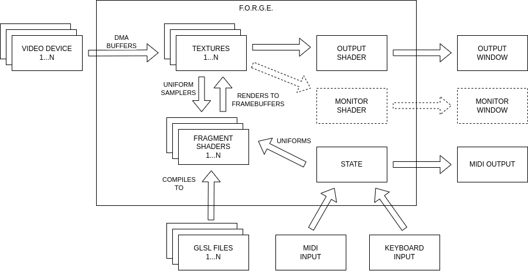
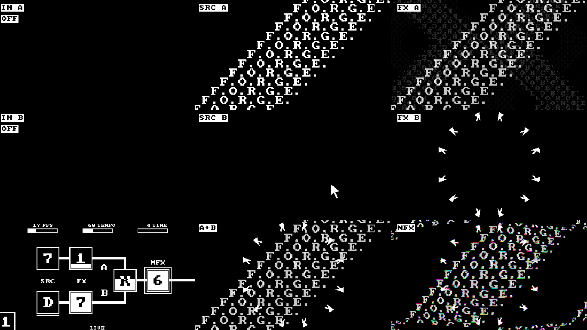

[](https://github.com/klemek/forge-steel/actions/workflows/ci.yml)
[](https://sonarcloud.io/summary/new_code?id=klemek_forge-steel)

<!-- omit from toc -->
# F.O.R.G.E. (Steel)

> **F**usion **O**f **R**eal-time **G**enerative **E**ffects

*Steel version (PC executable)*

Discover an engine where user-defined fragment shaders collide to produce stunning visuals.


See [Demo #1 - 1H](https://youtu.be/-RMXGxP8Uks) and [Demo #2 - Monitor View](https://youtu.be/q4ili24DlRE) on YouTube.

## Quick Start

FORGE default project is controlled with a [KORG nanoKONTROL2](https://www.korg.com/us/products/computergear/nanokontrol2/).

Don't worry if you don't have one, the demo mode will still run great.

After you [install](#install) the project, you can test run the following commands:

```shell
# demo mode, works out of the box
forge --demo
# see the monitor output
forge --demo --monitor-only
# open to another screen
forge --demo --screen=1
# open both output and monitor
forge --demo -screen=0 --monitor=1
# nanoKONTROL2 plugged, control the default project
forge
# nanoKONTROL2 plugged, add video devices
forge --video-in=/dev/video0 --video-in=/dev/video1
# run the sample projet and work on it
forge --project=./sample --hot-reload
```

### What to do next

Here are some pointers if you want to customize your FORGE experience:

* [Discover the hotkeys](#runtime-hotkeys)
* [Familiarize with the CLI arguments](#cli-arguments)
* [Discover how to use the default project](#default-project)
* [Make your own FORGE project](#making-your-own-forge-project)

<!-- omit from toc -->
## Table of Contents

- [Quick Start](#quick-start)
  - [What to do next](#what-to-do-next)
- [What is FORGE ?](#what-is-forge-)
- [Install](#install)
  - [Prerequisites](#prerequisites)
  - [From release](#from-release)
  - [From repository (PKGBUILD)](#from-repository-pkgbuild)
  - [From repository (dev version)](#from-repository-dev-version)
- [Usage](#usage)
  - [Runtime hotkeys](#runtime-hotkeys)
  - [CLI arguments](#cli-arguments)
- [Default Project](#default-project)
  - [Monitor and debug view](#monitor-and-debug-view)
  - [nanoKONTROL2 layout for the default project](#nanokontrol2-layout-for-the-default-project)
  - [Available sources and effects](#available-sources-and-effects)
- [Making your own FORGE project](#making-your-own-forge-project)
  - [`forge_project.cfg`](#forge_projectcfg)
  - [Writing your fragment shaders](#writing-your-fragment-shaders)
  - [Working with `#include`](#working-with-include)
- [Frequently Asked Questions](#frequently-asked-questions)
  - [Why "steel"?](#why-steel)
  - [My nanoKontrol2 is acting strange](#my-nanokontrol2-is-acting-strange)
  - [How do I report a bug?](#how-do-i-report-a-bug)
  - [Help I got low FPS on my video device](#help-i-got-low-fps-on-my-video-device)
  - [How do I change the default project built-in sentences?](#how-do-i-change-the-default-project-built-in-sentences)

## What is FORGE ?



TODO

## Install

### Prerequisites

| library   | apt            | pacman          |
| --------- | -------------- | --------------- |
| libglfw   | libglfw3-dev   | extra/glfw      |
| libGL     | libgl-dev      | extra/libglvnd  |
| libasound | libasound2-dev | extra/alsa-lib  |
| libv4l2   | libv4l-dev     | extra/v4l-utils |
| libbsd    | libbsd-dev     | extra/libbsd    |

### From release

See [Releases](https://github.com/klemek/forge-steel/releases)

```shell
tar xvzf forge-steel-x.y.z.tar.gz
cd forge-steel-x.y.z
./configure
make
make install
```

### From repository (PKGBUILD)

```shell
git clone --recursive https://github.com/klemek/forge-steel
cd forge
makepkg -si
```


### From repository (dev version)

```shell
git clone --recursive https://github.com/klemek/forge-steel
cd forge
aclocal
autoconf
automake --add-missing
./configure
make
make install
```

## Usage

### Runtime hotkeys

When running, the following hotkeys are available:

* <kbd>Esc</kbd>: Exit window
* <kbd>R</kbd>: Randomize shader state
* <kbd>D</kbd>: Demo mode On/Off
* <kbd>A</kbd>: Auto Random mode On/Off

### CLI arguments

```txt
usage: forge [-h] [-v] [-p=PROJECT_PATH] [-c=CFG_FILE] [-hr] [-s=SCREEN] [-m=SCREEN] [-mo] [-w] [-t=TEMPO] [-d] [-ar / -nar] [-v=FILE] [-vs=SIZE] [-is=SIZE] [-sf=STATE_PATH] [-ls / -nls] [-ss / -nss] [-tm] [-tf] 

Fusion Of Real-time Generative Effects.

options:
  -h, --help                show this help message and exit
  -v, --version             print version
  -p, --project             forge project directory (default: /usr/share/forge/default)
  -c, --config              config file name (default: forge_project.cfg)
  -hr, --hot-reload         hot reload of shaders scripts
  -s, --screen              output screen number (default: primary)
  -m, --monitor             monitor screen number (default: none)
  -mo, --monitor-only       no output screen
  -w, --windowed            not fullscreen
  -t, --tempo               base tempo (default: 60)
  -d, --demo                demonstration mode (assume --no-save-state, --no-load-state, --auto-random)
  -ar, --auto-random        randomize state every 4 beats
  -nar, --no-auto-random    do not randomize state (default)
  -v, --video-in            path to video capture device (multiple allowed)
  -vs, --video-size         video capture desired height (default: internal texture height)
  -is, --internal-size      internal texture height (default: 720)
  -sf, --state-file         saved state file (default: forge_saved_state.txt)
  -ls, --load-state         load saved state (default)
  -nls, --no-load-state     do not load saved state
  -ss, --save-state         save state (default)
  -nss, --no-save-state     do not save state
  -tm, --trace-midi         print midi code and values
  -tf, --trace-fps          print fps status of subsystems
```

## Default Project

> A.K.A Kleπek's shaders

FORGE come pre-loaded with a default project, the following explains how to use it.

### Monitor and debug view

When opening the monitor view, here's what to expect:



On the bottom left corner, here's how to read the internal state:


### nanoKONTROL2 layout for the default project

In order to control the default project, you can expect it to work with this layout:


> In blue is a sample "stage" as most sources/effects use a combination of 4 stages (see table below)

> ⚠️ you'll need to change your nanoKONTROL2 settings to remove the "toggle" behavior of the buttons and use "external" led control.
> (Use the [KORG KONTROL Editor](https://www.korg.com/us/support/download/software/1/133/1355/) and the [provided data file](./docs/forge.nktrl2_data) to setup your controller.)

### Available sources and effects

Working with pages and items, you can use the following predefined sources and effects:

| P     | #     | SRC               | _COL2_            | _COL3_          | _COL4_             | FX               | _COL6_          | _COL7_        | _COL8_         |
| ----- | ----- | ----------------- | ----------------- | --------------- | ------------------ | ---------------- | --------------- | ------------- | -------------- |
| **1** | **0** | Feedback + Thru   | _Hue_             | _Saturation_    | _Light_            | Thru             | _Hue_           | _Saturation_  | _Light        |
|       | **1** | Lines             | _Thick. / Dezoom_ | _Rotation_      | _Distortion_       | Feedback + Shift | _Zoom / Dezoom_ | _X Shift_     | _Y Shift_      |
|       | **2** | Dots              | _Zoom_            | _Rotation_      | _Lens_             | Shift            | _Zoom / Dezoom_ | _X Shift_     | _Y Shift_      |
|       | **3** | Waves             | _Spacing_         | _Thickness_     | _Vert. Scroll (R)_ | Colorize         | _Black Color_   | _White Color_ | _Shift_        |
|       | **4** | Noise             | _Zoom_            | _Voronoi dist._ | _Details_          | Quantize         | _Pixel Size_    | _Bit Depth_   | _Blur_         |
| **2** | **5** | Video In 1 + Thru | _Hue_             | _Saturation_    | _Light_            | Dithering        | _Pixel Size_    | _Bit Depth_   | _Blur_         |
|       | **6** | CP437             | _Zoom_            | _Charset_       | _Char. Delta_      | TV               | _Lens_          | _Horz. Noise_ | _Dezoom_       |
|       | **7** | Sentences         | _Zoom_            | _Sentence_      | _Vertical repeat_  | Kaleidoscope     | _Axes_          | _Rotation_    | _Horz. Scroll_ |
|       | **8** | Sentences repeat  | _X Shift_         | _Sentence_      | _Vertical repeat_  | CP437            | _Zoom_          | _Charset_     | _Char. Delta_  |
|       | **9** | Isometric grid    | _Zoom_            | _Scroll_        | _Elevation_        | Lens             | _Lens limit_    | _Lens power_  | _Pre Zoom_     |
| **3** | **A** | Video In 2 + Thru | _Hue_             | _Saturation_    | _Light_            | Spill            | _Bottom limit_  | _Top Limit_   | _Rotation_     |
|       | **B** | Scales            | _Zoom_            | _Shape_         | _Ripples_          | Game Of Life     | _Pixel Size_    | _Ruleset/Threshold_ | _Feedback_               |
|       | **C** | Credenza          | _Zoom_            | _Shape_         | _Ripples_          | Sobel Filter    | _Horz. filter_   | _Vert. filter_ | _Filter Size_ |
|       | **D** | Cursor            | _Size_            | _Pos X_         | _Pos Y_            | Isometric       | _Zoom_           | _Scroll_       | _Rotate_      |
|       | **E** | (Random source)   | ---               | ---             | ---                | (Random effect)  | ---              | ---          |  ---          |

## Making your own FORGE project

TODO

### `forge_project.cfg`

TODO

### Writing your fragment shaders

TODO

### Working with `#include`

TODO

## Frequently Asked Questions

### Why "steel"?

FORGE is a concept which is intended to be derived onto other forms (like Raspberry PI). In order to differentiate between them each would be name after a different alloy.

FORGE (steel) describe the linux version.

### My nanoKontrol2 is acting strange

You may need to change your NanoKontrol2 settings to remove the "toggle" behavior of the buttons and use "external" led control.

Use the [KORG KONTROL Editor](https://www.korg.com/us/support/download/software/1/133/1355/) and the [provided data file](./docs/forge.nktrl2_data) to setup your controller.

### How do I report a bug?

You're free to open a new issue in the [Issues page](https://github.com/klemek/forge-steel/issues).

Don't forget to add all information available to your bug (version, operating system, etc.).

### Help I got low FPS on my video device

There's already an [open issue](https://github.com/klemek/forge-steel/issues/1) on this subject.

### How do I change the default project built-in sentences?

The sentences are defined in [default/inc_sentences.glsl](./default/inc_sentences.glsl).

The script [scripts/sentences.py] can help you update them.
